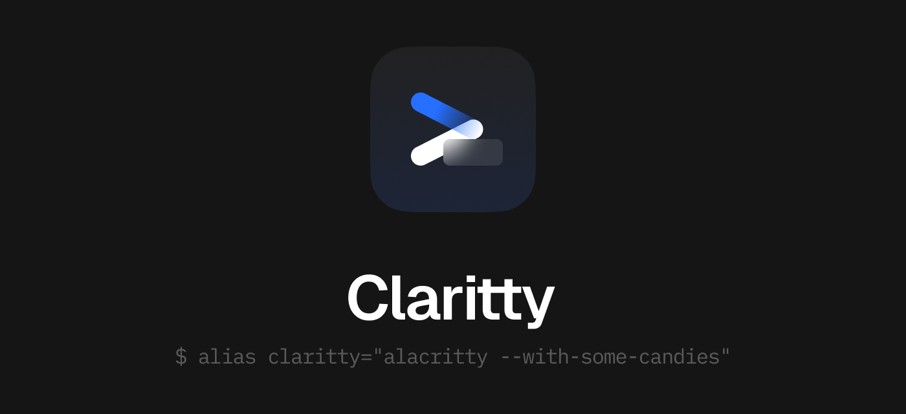

<p align="center">
  <b>Claritty</b><br>
  <code>$ alias claritty="alacritty --with-some-candies"</code>
</p>

## Motivation
* There's no such terminal which is appealing to me and supports vibrancy on macOS. (I'm using kitty now)
* There are some long-living PRs, which are not merged by the alacritty team yet.

## Goals
* Making a terminal emulator, which works on my machine (TM).
* Cherry-picking some PRs which I want to use in my machine.
* Learning the Rust programming language.

## Non-goals
* Making a terminal emulator, which works on **others machine**.
* Merging some patches to the upstream.

## In one sentence
> [!WARNING]
> Use at your own risk. This might be buggy and would not work on your machine

## Features
* Vibrancy  
* Scrollbar  
* Granular Paddings  
* Sixels (not yet)

## Development
```
$ git clone ssh://git@github.com/HelloWorld017/claritty.git
$ make init
```

Then please read the `workspace/INSTALL.md`.  
After modifying the codes, run `$ make extract-patch`
